[USER](https://docs.google.com/document/d/1QYRqhlLIKZukCvYksafBDikCVv8RiSYwsBR3amU2tzs/edit#heading=h.ihv636)
MANUAL

 Hospital Bed Tracking System

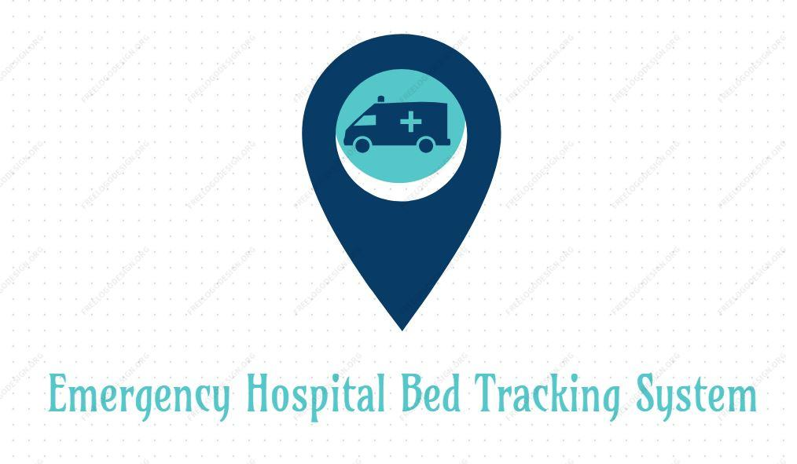

**Created by:**

*Aviral Sharma*

*Abhinav Kamboj*

*Aditya Koul*

*Abhishek Kumar Tamoli*

**Introduction**
================

The Hospital Bed Tracking system is an application developed
for the current crisis due to COVI-19 to help people in knowing the available
beds in the nearest hospital. The application will also allow people to
know about the different types of beds available in the hospital. The
application will be a web based application which will also be mobile
friendly.

**Purpose**
===========

The purpose of this application is to eliminate all the problems faced
by people(patients) andby the hospital management. Our team has 
come up with the  solution of developing an application which would 
coordinate with hospitals to have real time update on the type of beds 
available at a given point of time.

**Process and Administration**
==============================

There are 3 different type of actors who access  Bed Tracking
Application.

1. **First Responder**

First Responder performs the following action.

1.  Navigating to the nearest hospital using the map available in the
    Home screen.

2.  Check for the Bed Availability of different hospital which also
    contains bed type.

3.  Check daily report or weekly report on the number of beds used in
    the hospital.

2. **Administrator**

Administrator performs the following task.

1.  Add/Update/Delete Hospital

2.  Add/Update/Delete Nurse

3.  Create login credentials for nurse

4.  Regular maintenance of the system

3. **Nurse**

Nurse performs the following task.

1.  Add/Update/Delete of the patient’s details

2.  Add bed details

**Logging In**
==============

In our application admin and nurse can login through same login page.
Admin is the only user who has ability to create, update, read and
delete a nurse and hospital. Whereas, nurse can only create, update,
read and delete a patient and bed details.

1.  **Admin**
    ----------

    1.  ### **Login**

The screen below is a common screen for both admin and nurse, the
authentication for the user is defined in the backend, so that a user
will see their respective page on login to the application.

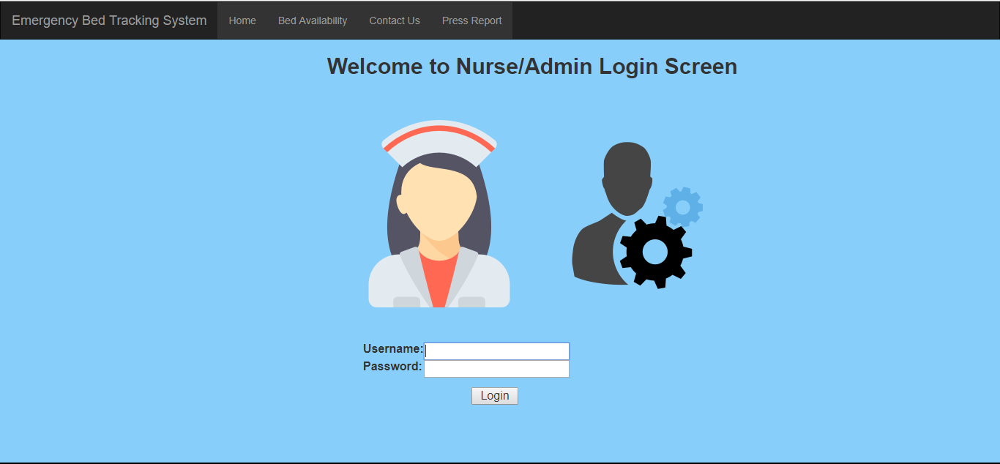

### **Admin Home Screen**

The below screen is the home screen which appears after the successful
login of the admin.

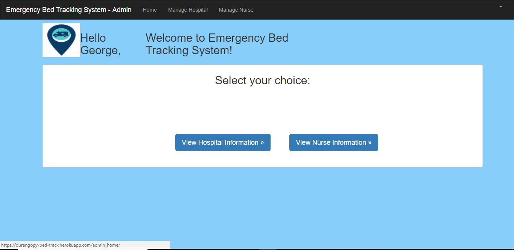

### **Admin Logout Screen**

The screen below is the logout screen for admin

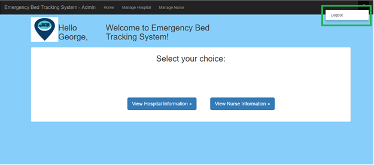

1.  **Nurse**
    ----------

    1.  ### **Login**

The login screen is same a admin login screen, but logging with nurse
credentials, the user will be navigated to nurse home screen.

### **Nurse Home Screen**

The below home screen appears on the successful login of nurse.

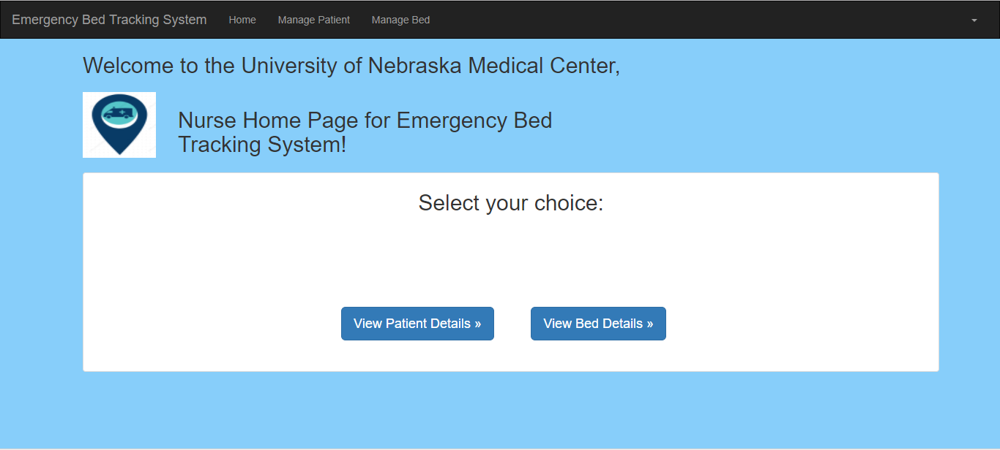

### **Nurse Logout Screen**

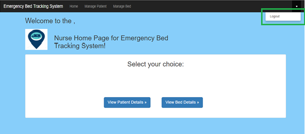

1.  **Screen Navigation**
    =====================

    1.  **First Responder**
        -------------------

        1.  ### **Home Screen**

The screen below is the home screen for first responder, the first
responder doesn’t have to login, in order to use this application. The
home screen has map which would help the first responder to navigate to
the nearest hospital.

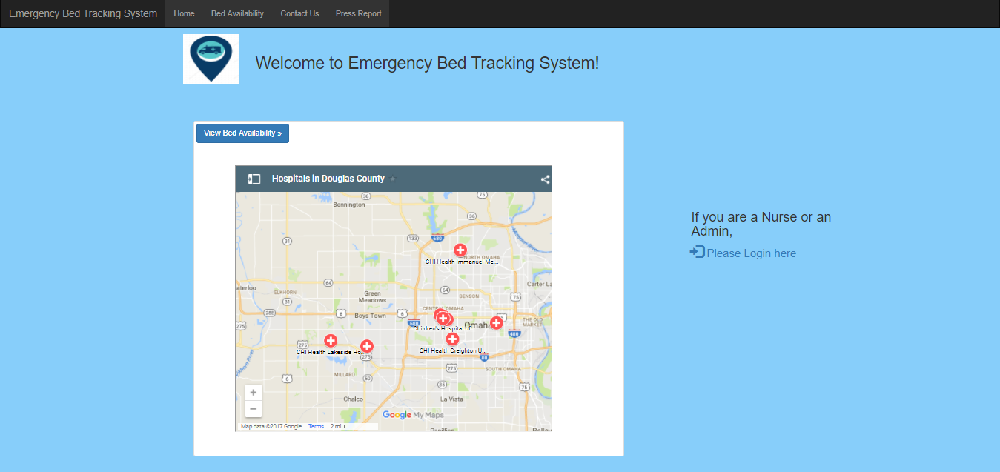

### **Bed Availability Screen**

Bed availability screen will show the details of the bed available in
the hospital along with the bed types.

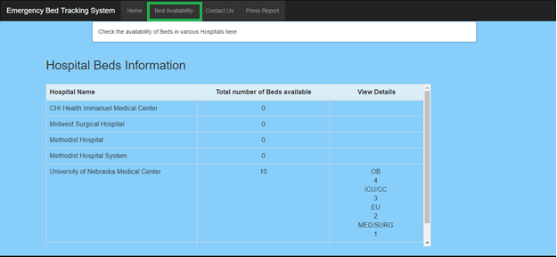

### **Press Report Screen**

Press report shows the report of the beds been used by each hospital.

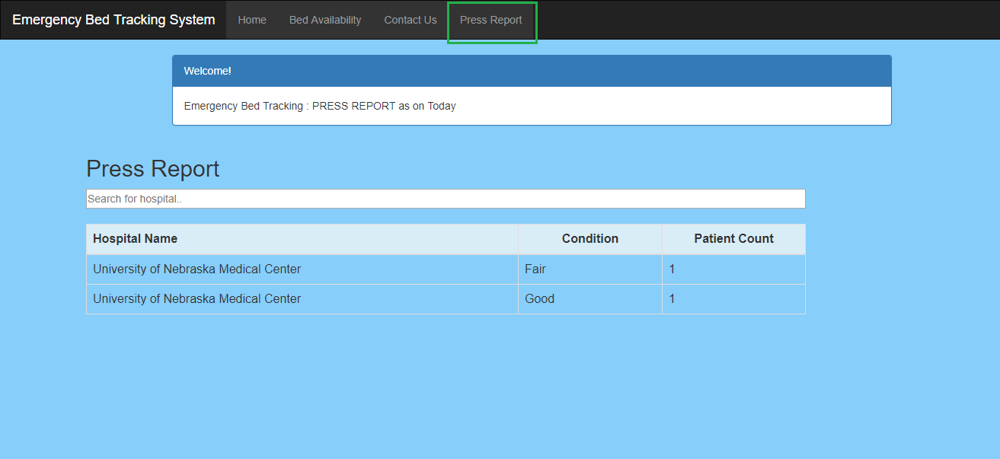

### **Contact – US Screen**

Users can contact us and share their feedback by submitting in question
text box provided in contact us page.

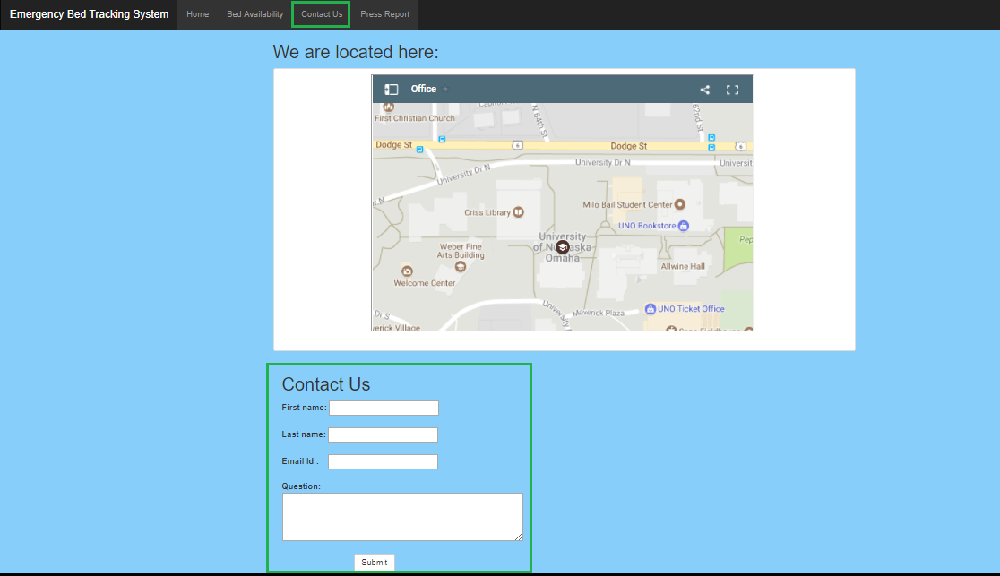

1.  **Admin**
    ---------

    1.  ### **Home Screen**

From home screen, admin can navigate to manage hospital to
add/delete/update hospitals by clicking on view hospital information or
manage hospital. Similarly, admin can also add/update/delete nurse by
clicking on view nurse information or manage nurse.

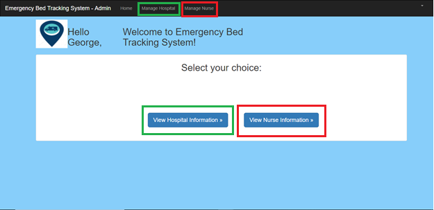

### **Manage Hospital Screen**

Admin can add hospital by clicking on “Add hospital” (6.2.3), to update
the hospital details the admin can click on “Edit Hospital
information’s” (6.2.4) and clicking on “delete hospital information”
(6.2.5) will delete the hospital.

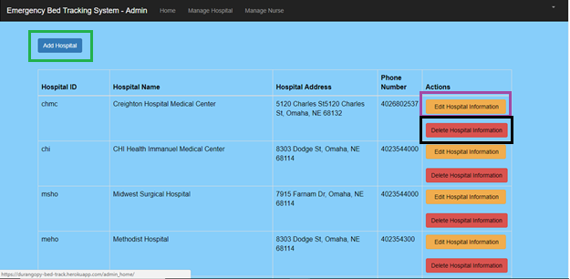

### **Add Hospital Screen**

Hospital details are added in the below screen and clicking on “Save”
button would save the new hospital.

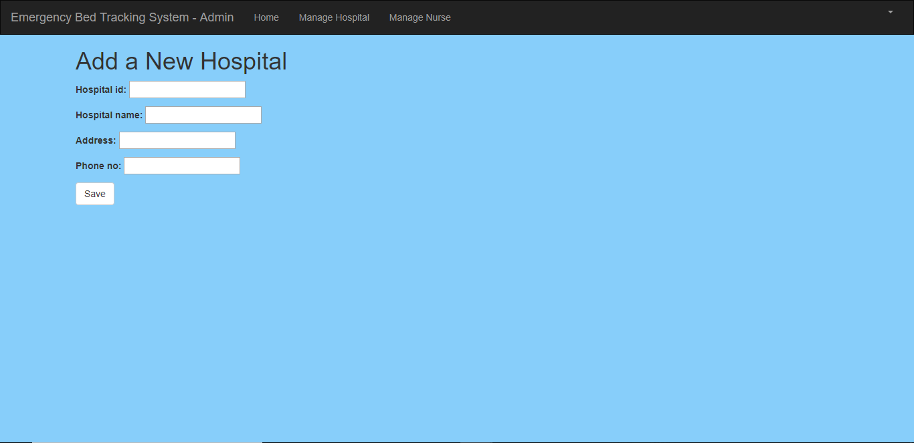

### **Update Hospital**

Existing hospital can be updated and the updating screen looks as shown
below. Clicking on “update” button would save the changes.

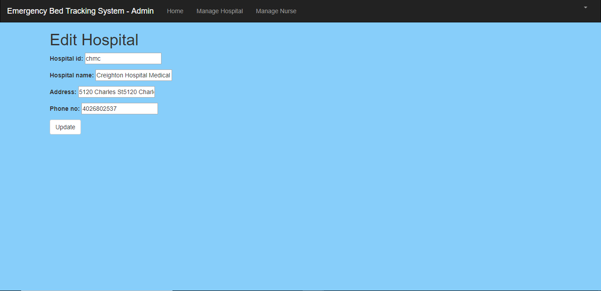

### **Delete Hospital**

Below screen is displayed when we want to delete the hospital. Clicking
on “Ok” in the pop would delete the hospital and clicking on “cancel”
would cancel the delete.

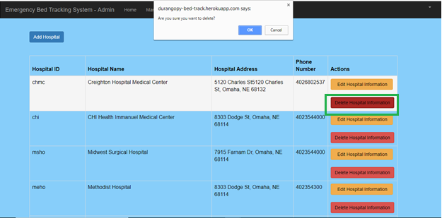

### **Admin – Manage Nurse Screen**

Admin can add nurse by clicking on “Add New Nurse” (6.2.7), to update
the nurse details the admin can click on “Edit Nurse information’s”
(6.2.8) and clicking on “delete nurse information” (6.2.9) will delete
the nurse.

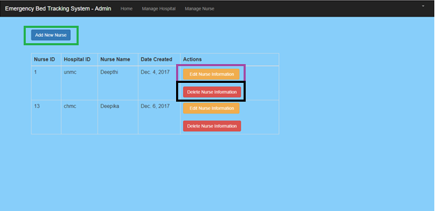

### **Admin - Add Nurse**

Add Nurse screen looks as shown below and clicking on “Save” would save
the new nurse.

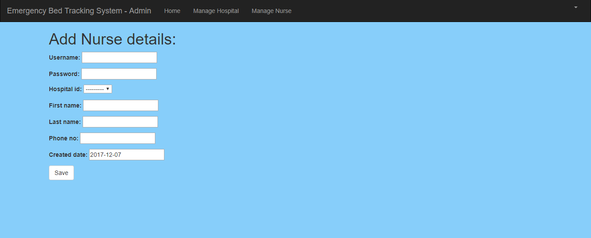

### **Admin - Update Nurse**

Existing Nurse can be updated and the edit screen looks as below.
Clicking on “update” button would save the changes.

### **Admin - Delete Nurse**

Below screen is displayed when we want to delete the nurse. Clicking on
“Ok” in the pop would delete the nurse and clicking on “cancel” would
cancel the delete.

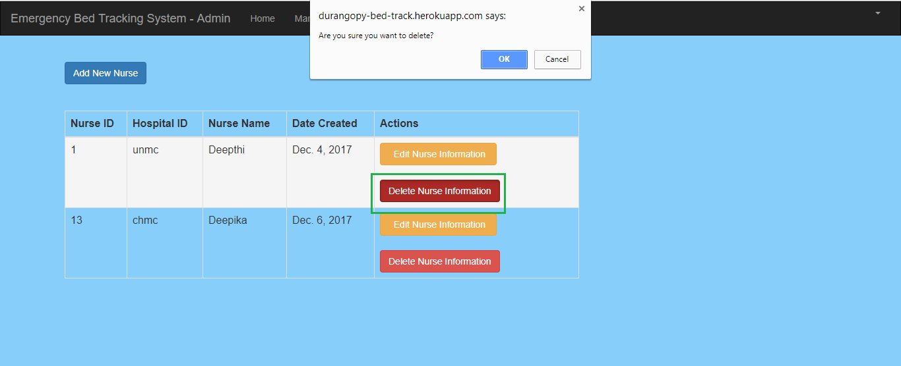

1.  **Nurse**
    ---------

    1.  ### **Home**

From home screen, nurse can add/delete/update patient by clicking on
view patient details or manage patient. Similarly, nurse can
add/update/delete beds by clicking on view bed details or manage
bed.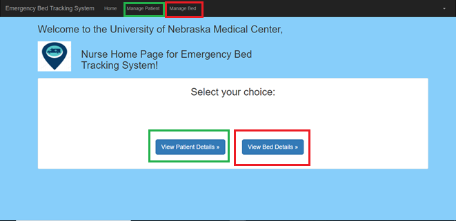

### **Manage Patient**

Nurse can add patients by clicking on “Add Patient” (6.3.3), to update
the patient details the nurse can click on “Update patient info” (6.3.4)
and clicking on “delete patient” (6.3.5) will delete the patient.

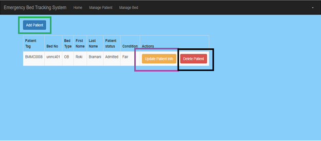

### **Add Patient**

Add patient screen looks as shown below and by clicking on “Save” button
it would save the new patient.

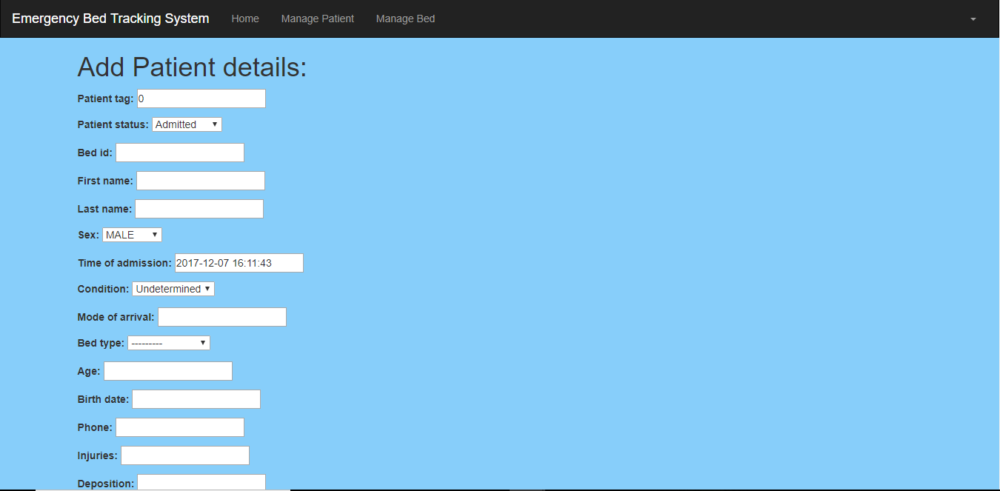

### **Update Patient**

Existing patient can be updated and the update screen for patients looks
as below. Clicking on “update” button would save the changes.

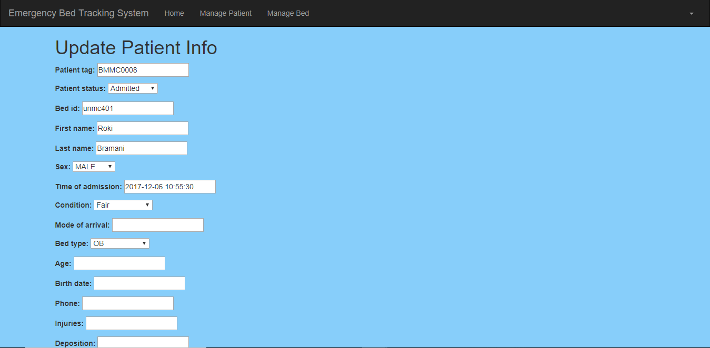

### **Delete Patient**

Below screen is displayed when we want to delete the patient. Clicking
on “Ok” in the pop would delete the patient and clicking on “cancel”
would cancel the delete.

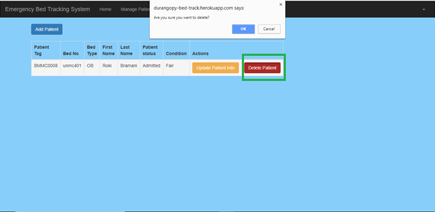

### **Manage Bed**

Nurse can add beds by clicking on “Add Bed info” (6.3.7).

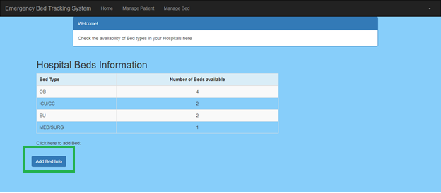

### **Add Bed**

Bed details are added in the below screen and clicking on “Save” button
would save the new bed details.

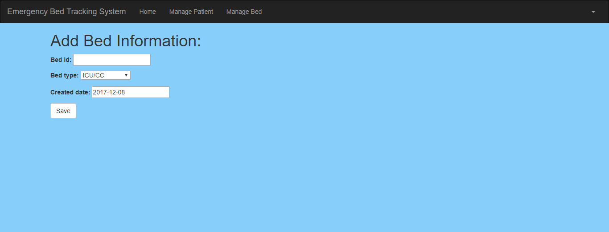
